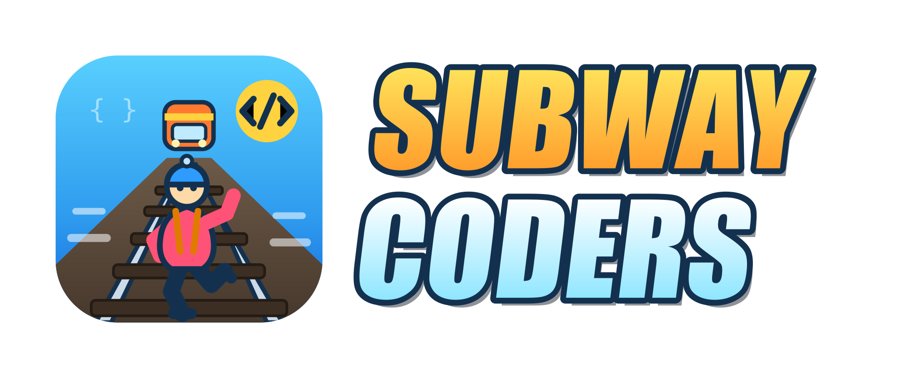

<p align="center">
  
</p>

<p align="center">
  <a href="https://plugins.jetbrains.com/plugin/32509"></a>
  <a href="https://plugins.jetbrains.com/plugin/32509"></a>
  <a href="https://plugins.jetbrains.com/plugin/32509"></a>
</p>

# Subway Coders 🏄

A fun JetBrains/IntelliJ plugin that plays looping **Subway Surfers**-style gameplay (plus
Minecraft parkour/story, Temple Run and other "brain-rot" clips) in tool windows inside your
IDE, so your subconscious stays maximally engaged while you read code.

Clips are rendered with **JCEF** (the Chromium browser bundled with the JetBrains Runtime) — a
YouTube link plays as an embed, any other URL as a looping video. Four independent players are
available, one per screen edge.

## Features

- **Four independent players** — one tool window per edge: left, right, top, bottom
- Each window remembers its own category
- **Config-driven categories** — every category can hold several clips; the window plays a random
  one and "Shuffle" picks another (default categories: Subway Surfers, Temple Run, Minecraft
  Parkour, Minecraft Story, GTA Ramps, Satisfying, Slime)
- A clip can be a **YouTube link** or a **direct video URL** (e.g. WebM on your own server)
- Paste any video URL into a window to override the category
- Clips play **muted** so autoplay isn't blocked; use the player's own controls to unmute
- Hide the toolbar per window via **Show Controls** in the tool window's options (gear) menu

## Configuring categories & clips

Categories and their clips are defined in JSON:

- Bundled default: `src/main/resources/config/default-categories.json`
- Your editable copy (created on first run): `<IDE config dir>/subway-coders/categories.json`

Open the tool window's options (gear) menu and click **Edit Config…** to open that file, edit it,
then click **Shuffle** in the player's toolbar to re-read it. Each clip is a URL — a YouTube link
or a direct video file you host yourself:

```json
{
  "categories": [
    { "name": "Minecraft Story", "clips": [
      "https://youtu.be/n_Dv4JMiwK8",
      "https://media.example.com/clips/my-minecraft-story.webm"
    ] }
  ]
}
```

## Install from JetBrains Marketplace

The easiest way: open *Settings → Plugins → Marketplace*, search for **Subway Coders** and click
**Install** — or grab it directly from the
[Marketplace page](https://plugins.jetbrains.com/plugin/32509).

## Run it (development)

Requirements: JDK 21.

```bash
./gradlew runIde
```

First run downloads the IntelliJ Platform SDK (a few hundred MB), then launches a sandbox IDE
with the plugin installed. Open any of the **Subway Coders Left/Right/Top/Bottom** tool windows from
the corresponding edge and pick a category.

## Build an installable plugin zip

```bash
./gradlew buildPlugin
# -> build/distributions/subway-jetbrains-extension-1.0.0.zip
```

Install via *Settings → Plugins → ⚙ → Install Plugin from Disk…*

## License

[MIT](LICENSE) © suprexde
